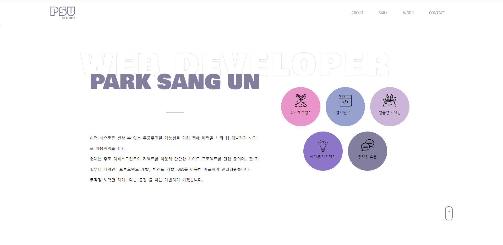
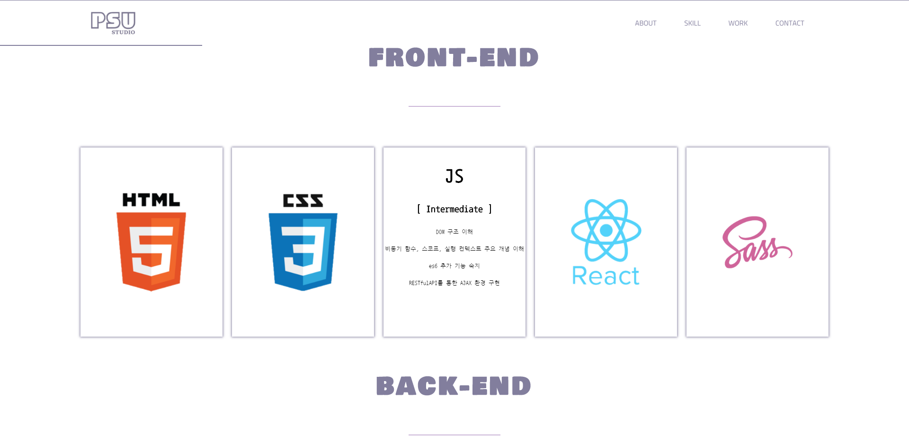
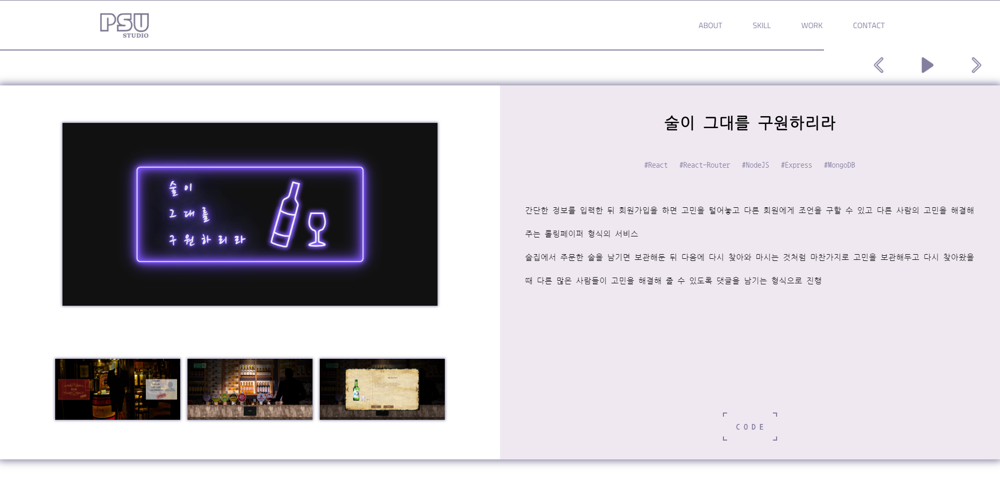
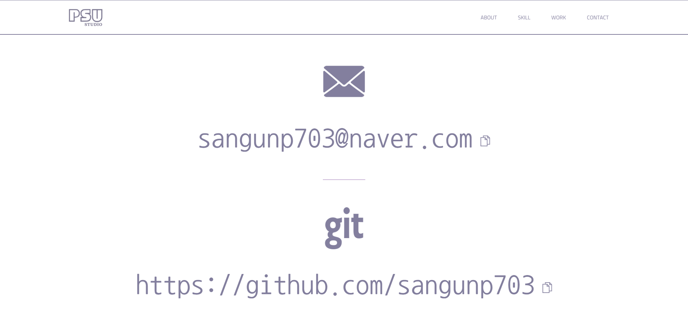

# 박상운 포트폴리오

라이브러리나 프레임워크의 도움 없이 VanillaJS로 만든 자기소개 페이지 
개발자의 간단한 소개와 기술역량, 프로젝트, 연락처 정보를 얻을 수 있다.

## 사용기술

- VanillaJS
- Sass

## 스크린샷

- about section
  
  개발자의 간단한 소개와 특징을 표현 
  상단 헤더를 통해 원하는 섹션으로 이동 가능

- skill section
  
  개발자의 기술 수준과 역량 표현 
  마우스를 각 스킬 카드에 올려 놓으면 설명이 표출

- work section
  
  개발자가 개발한 프로젝트들의 스크린샷, 설명, 코드를 볼 수 있다. 
  우측 상단의 컨트롤러로 슬라이드를 조종 
  작은 사진을 클릭하면 위의 큰 사진과 위치가 변경 
  code 버튼을 눌러서 해당 코드의 Github 페이지로 이동

- contact section
  
  개발자의 이메일과 Github 주소를 알 수 있다. 
  이메일과 Github 주소를 클릭하면 정보가 클립보드에 복사된다
